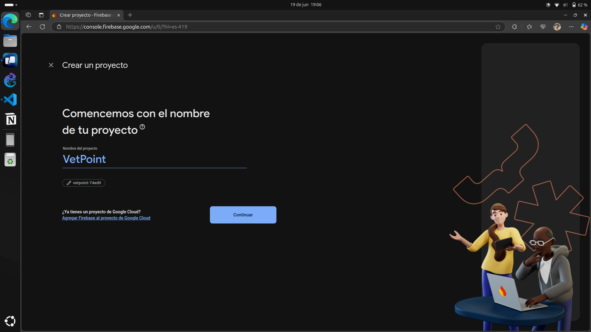
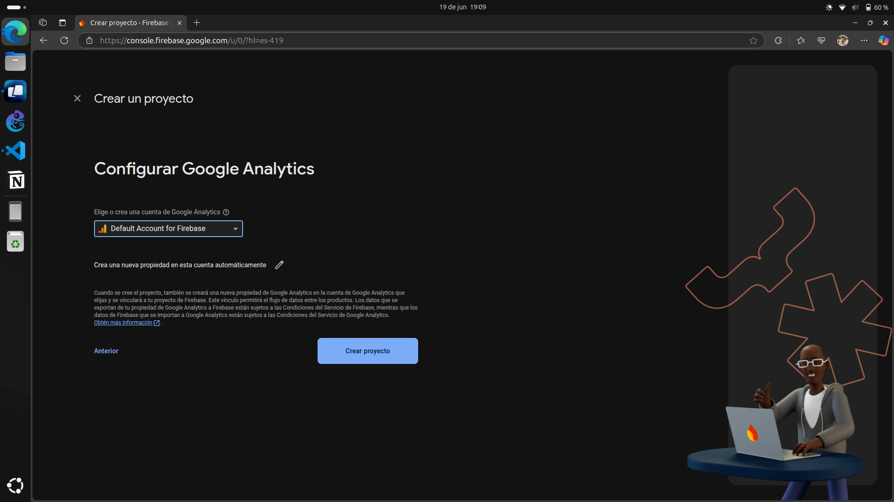
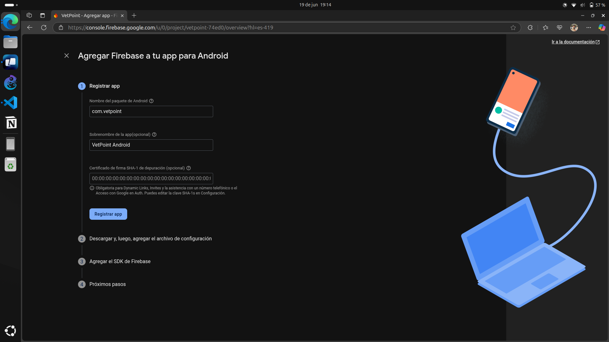
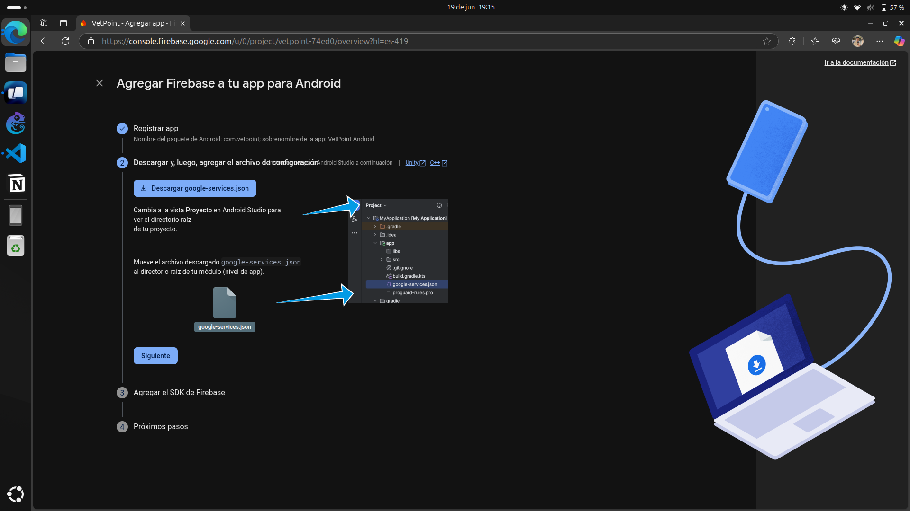

# VetPoint: Gestión Veterinaria Móvil

|  |  |
|:-------------------------------------:|:-------------------------------------:|

**VetPoint** es una aplicación móvil que hemos desarrollado con React Native para ayudar a profesionales de la veterinaria a gestionar la información de sus pacientes de manera eficiente y organizada. Nuestro objetivo con esta app es permitir llevar un registro detallado de los pacientes, sus dueños, diagnósticos y tratamientos, todo desde un dispositivo móvil.

---

## ✨ Características Principales

* **Autenticación de Usuarios**: Sistema seguro de registro e inicio de sesión para veterinarios usando Firebase Auth.
* **Gestión Completa de Pacientes (CRUD)**: La app permite crear, leer, actualizar y eliminar las fichas de los pacientes, guardando información detallada como nombre, especie, raza, edad, propietario, síntomas y tratamientos.
* **Dashboard Interactivo**: Un panel principal que visualiza estadísticas clave y ordena a los pacientes por urgencia y fecha de creación para una mejor priorización.
* **Búsqueda y Filtros**: Funcionalidad para encontrar pacientes rápidamente por nombre, especie o propietario, y para filtrarlos por su estado actual.
* **Notificaciones de Citas**: Se pueden programar notificaciones locales para recordar las próximas citas de los pacientes.
* **Perfil de Usuario**: Cada veterinario puede visualizar y gestionar su información profesional.
* **Tema Claro y Oscuro**: Interfaz adaptable a las preferencias del sistema para una mejor experiencia visual.

---

## 🚀 Tecnologías Utilizadas

* **Framework**: React Native
* **Lenguaje**: TypeScript
* **Backend como Servicio (BaaS)**: Firebase (Authentication y Firestore)
* **Navegación**: React Navigation (Stack y Bottom Tabs)
* **Notificaciones**: `react-native-push-notification`
* **Iconografía y SVG**: `react-native-vector-icons` y `react-native-svg`
* **Gestión de Estado**: React Context API

---

## 🛠️ Guía de Instalación y Configuración

Sigue estos pasos en orden para configurar tu entorno de desarrollo y ejecutar el proyecto.

### Paso 1: Configurar Entorno de Desarrollo (Windows)

Primero, necesitas preparar tu máquina con las herramientas adecuadas.

1. **Instalar Chocolatey (Gestor de Paquetes)**: Facilita la instalación del resto de dependencias.
    * Abre **PowerShell como Administrador** y ejecuta:

        ```powershell
        Set-ExecutionPolicy Bypass -Scope Process -Force; [System.Net.ServicePointManager]::SecurityProtocol = [System.Net.ServicePointManager]::SecurityProtocol -bor 3072; iex ((New-Object System.Net.WebClient).DownloadString('[https://community.chocolatey.org/install.ps1](https://community.chocolatey.org/install.ps1)'))
        ```

    * Cierra y vuelve a abrir PowerShell como administrador.

2. **Instalar Node.js y JDK**:
    * El proyecto requiere Node.js 18+ y el JDK 11. Con Chocolatey, puedes instalarlos con un solo comando:

        ```powershell
        choco install -y nodejs-lts openjdk11
        ```

3. **Instalar Android Studio**:
    * Descarga e instala [Android Studio](https://developer.android.com/studio).
    * Durante la instalación, asegúrate de marcar `Android SDK`, `Android SDK Platform` y `Android Virtual Device`.

4. **Configurar Variables de Entorno de Android**:
    * Abre "Editar las variables de entorno del sistema" en Windows.
    * Crea una nueva variable de usuario `ANDROID_HOME` con la ruta: `%LOCALAPPDATA%\Android\Sdk`.
    * Edita la variable `Path` y añade una nueva entrada: `%ANDROID_HOME%\platform-tools`.

### Paso 2: Configurar el Proyecto de Firebase

La aplicación necesita un proyecto de Firebase para la base de datos y la autenticación.

1. **Crear Proyecto en Firebase**:
    * Ve a la [Consola de Firebase](https://console.firebase.google.com/), crea un proyecto nuevo.
    * **

2. **Habilitar Servicios**:
    * En el menú de **Compilación (Build)**, habilita los siguientes servicios:
        * **Authentication**: Pestaña "Sign-in method" -> Habilita **Correo electrónico/Contraseña**.
        * **Firestore Database**: Crea una base de datos, puedes iniciar en **modo de prueba**.
    * **

3. **Conectar la App de Android**:
    * En la vista general del proyecto de Firebase, haz clic en el icono de Android (🤖) para registrar tu app.
    * Usa `com.vetpoint` como el **nombre del paquete de Android**.
    * **
    * Descarga el archivo `google-services.json` y muévelo a la carpeta `android/app/` de este proyecto.
    * **

### Paso 3: Instalar y Ejecutar VetPoint

1. **Clona el repositorio:**

    ```bash
    git clone [https://github.com/llamosasng/vetpoint.git](https://github.com/llamosasng/vetpoint.git)
    cd vetpoint
    ```

2. **Instala las dependencias del proyecto:**

    ```bash
    npm install
    ```

3. **Ejecuta la aplicación en Android:**
    * Abre Android Studio y lanza un emulador desde el **Virtual Device Manager**.
    * Una vez que el emulador esté corriendo, ejecuta el siguiente comando en tu terminal:

    ```bash
    npm run android
    ```

¡La aplicación debería compilarse e iniciarse en el emulador!

|  |  |
|:-------------------------------------:|:-------------------------------------:|

---

## 📂 Estructura del Proyecto

src/
├── assets/         # Imágenes, SVGs y otros recursos estáticos
├── components/     # Componentes de UI reutilizables
│   ├── feature/    # Componentes complejos con lógica de negocio
│   └── ui/         # Componentes básicos (Botones, Inputs, Cards)
├── context/        # Contextos de React para la gestión del estado global
├── navigation/     # Configuración de React Navigation y tipos
├── screens/        # Las pantallas principales de la aplicación
├── services/       # Servicios (ej. notificaciones)
├── types/          # Definiciones de tipos de TypeScript
└── utils/          # Funciones de utilidad y datos de prueba

---

## 🤝 Contribuciones

¡Las contribuciones son siempre bienvenidas! Si deseas mejorar la aplicación, por favor sigue estos pasos:

1. Haz un "Fork" del proyecto.
2. Crea una nueva rama para tu funcionalidad (`git checkout -b feature/AmazingFeature`).
3. Implementa tus cambios.
4. Realiza un "Commit" de tus cambios (`git commit -m 'Add some AmazingFeature'`).
5. Haz "Push" a la rama (`git push origin feature/AmazingFeature`).
6. Abre un "Pull Request".
